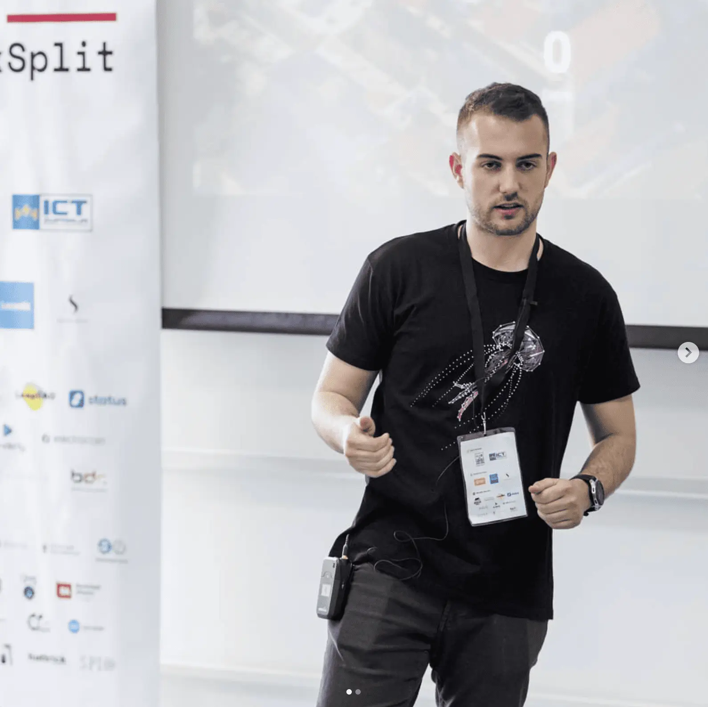

## From Med School to AI First Healthcare

Before AI in healthcare was mainstream, before GPT models made headlines, **Marino Sabijan** was already deep in the trenches. A medical doctor by training and a self-taught developer by necessity, he’s been obsessed with **automating and decentralizing healthcare** long before the tools existed to make it truly scalable.


  


Back in 2018, “AI” in medicine was just **a glorified decision tree;** rigid, rule-based, and painfully limited. Still, Marino built **early AI chatbots** designed to automate **patient triage and lifestyle recommendations**, proving that even **basic automation could reduce strain on an overburdened system**.

But it wasn’t enough.

Healthcare wasn’t just **inefficient,** it was **fundamentally broken**. Patient data sat in **silos**, insurance models were **opaque**, and even **doctors struggled with fragmented records**. That’s when another obsession kicked in:

### Pioneering Blockchain in Healthcare

Even in his second year of med school, Marino was **sketching out blueprints** for a system where **blockchain could secure patient data** and streamline payments.



In 2019, he took the stage at **Blocksplit**, presenting a future where **distributed ledgers handled everything from transparent insurance billing to tamper-proof medical records**.

Most of the **medical world** dismissed it as **too futuristic**.

But **Marino knew the tech was inevitable**.

Fast-forward, and **everything** is shifting, blockchain is securing **EHRs**, AI is writing **medical notes**, and automation is replacing **clinical workflows**.

The problem? **No one’s putting it all together.**

**Enter OmegaX Health.**

## The AI Revolution: From Hardcoded Scripts to Autonomous Healthcare

Before **GPT**, AI assistants were a nightmare to build:

- **Manual NLP scripting** – Every symptom, every question, every chatbot reply had to be **hardcoded**.
- **Rigid logic trees** – A **single tweak** could break entire workflows, making iteration painfully slow.
- **Zero adaptability** – Chatbots couldn’t **think**, they could only **spit out predefined responses**.

Even then, the **potential was obvious**—a machine answering patient questions **on demand** could fundamentally change healthcare.

> Marino was building AI health agents from 2018 - 2021, pre gpt. After reading a research article back in 2020 about the potential of generative AI chatbots it was "too futuristic" or "chatbots cant be so smart" to be applied in healthcare.
> 

Then **GPT happened**.

What was once **a brute-force engineering problem** turned into **a scalable intelligence model**:

✅ **Natural conversations** – No more robotic scripts—GPT could **reason like a doctor**, delivering nuanced, context-rich dialogue.

✅ **Infinite scalability** – No need to hardcode **every single symptom**—AI could learn **on the fly**.

✅ **Integrated intelligence** – AI could **cross-reference wearables, vitals, and history**, detecting **early warning signs** before symptoms escalate.

Suddenly, building an **AI doctor wasn’t a dream—it was inevitable.**

But **innovation without execution is just an idea.** To make this vision real, OmegaX Health needed to be structured as a **serious, global company**—one that can move fast, attract top talent, and operate in the most **friendly regulatory environments**.

## OmegaX: Structuring for Global Scale

OmegaX Health will be incorporated as a **Freezone company in Dubai, UAE**, leveraging its **pro-business environment, AI-forward policies, and strong international positioning**. Dubai offers a **strategic gateway between global markets**, allowing OmegaX to operate at the intersection of **healthcare, AI, and Web3 innovation** while maintaining regulatory flexibility.

While Dubai serves as the **operational and legal base**, OmegaX will function as a **remote-first company**, assembling a distributed team of **engineers, AI researchers, medical professionals, and business operators**. This structure ensures **scalability and speed**, allowing OmegaX to adapt rapidly to **market demands and technological advancements**.