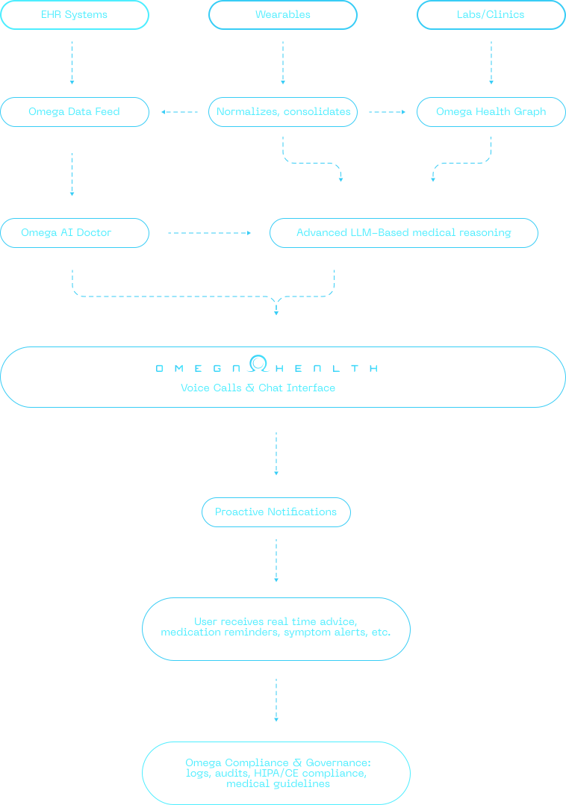

Below is a **high-level** architecture sketch showing how **OmegaX** handles healthcare data, applies AI-driven medical reasoning, and engages with users. We focus on **medical** workflows—rather than implementation details like programming languages or specific databases.

## **Key Components**

1. [**Omega Data Feed**](data-feed)
    - Collect user metrics (vitals, lab results, EHR data), unify different sources (wearables, clinics, Apple HealthKit, etc.), and **pre-process** them (unit standardization, timestamp alignment).
    - Ensures all health data—whether from a hospital or a smartwatch—flows into one coherent medical record for **AI analysis**.
2. [**Omega Health Graph**](health-graph)
    - Acts as a **central knowledge layer** of each user’s health profile—covering conditions, historical vitals, medication schedules, and more.
    - The AI Doctor can query this graph to see a comprehensive patient record.
3. [**Omega AI Doctor**](ai-doctors)
    - Combines advanced LLM reasoning with **medical guidelines** (cardiology, endocrinology, mental health protocols, etc.).
    - **Actions**:
        - Generates personalized care plans (e.g., adjusting exercise for a hypertensive patient).
        - Flags potential emergencies (e.g., critically high blood pressure readings).
        - Integrates clinical best practices (e.g., guidelines for medication dosage changes).
4. [**User Engagement**](ai-doctors/#4-interaction-modes-talk-type-or-tap)
    - **Omega Voice Calls**: Automated or on-demand calls to discuss new health findings.
    - **Omega Chat Interface**: Text-based interactions for quick Q&A, symptom checks, or daily check-ins.
    - **Proactive Notifications**: Mobile or email alerts prompting immediate attention (missed medication, abnormal vitals).
5. [**Compliance & Governance**](../omegax-platform/medical-dao)
    - **Purpose**: Maintain **medical-grade** auditing and security. Track data access, store logs for HIPAA/CE.
    - **Scope**: Any AI recommendation, user’s data change, or manual override by a healthcare professional is recorded and can be reviewed for regulatory compliance.

## **Typical User Journey**

{}

### Step 1: Data Capture

A **wearable device** detects an elevated heart rate and logs the reading.

### Step 2: Ingestion & Health Graph

The new reading merges with existing health data (**BP history, known conditions**) to provide a more comprehensive health profile.

### Step 3: AI Doctor Assessment

The **AI Doctor** evaluates the risk (e.g., detects recent high-stress indicators) and suggests a **calming activity** or a **medication check** if necessary.

### Step 4: User Alert

A **voice call or push notification** explains the concern and provides **recommended next steps** for the user.

### Step 5: Governance & Compliance

All interactions—**data updates, AI suggestions, voice call logs**—are stored in the **compliance layer** for audits or potential medical handoffs.

{}

> In essence, OmegaX merges clinical best practices with modern AI to give each user an on-demand “doctor in your pocket.” Data from traditional EHRs, labs, and wearables feed into a unified health graph, enabling the Omega AI Doctor to craft context-aware interventions—delivered via human-like voice calls or quick chat, all while respecting stringent medical regulations.

## Dive Deeper


  
  
  


These pages dive deeper into each major aspect of the OmegaX backend, covering ingestion pipelines, AI logic and data relationships.