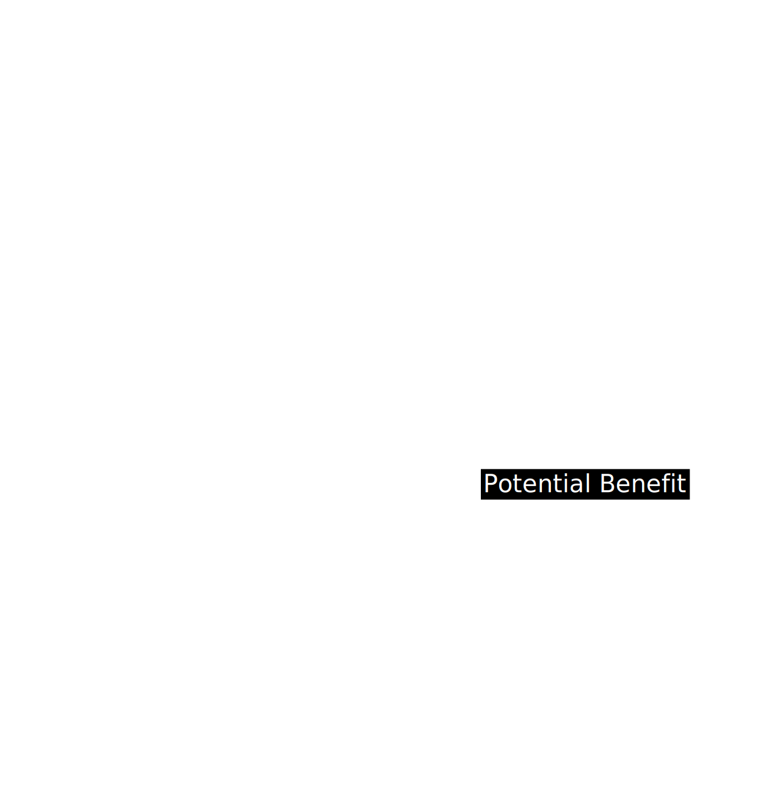

The Health Graph is the underlying data model that organizes every piece of a user’s health information—from individual vitals to long-term trends—into a unified, interconnected structure. It’s more than just a database table: it’s a dynamic network of relationships that helps the AI Doctor see how each data point impacts the user’s overall health.

> [!NOTE]
> **Key Idea:** The **Health Graph** links data in context, allowing OmegaX to deliver **personalized and proactive care**.
>
> - A **heart rate measurement at 5 AM** is analyzed **alongside sleep quality and medication schedules**.
> - AI considers **multiple factors together**, rather than isolated readings, for more **accurate insights and recommendations**.

## 1. What is the Health Graph?

Think of it as a **map** where each “node” represents a specific piece of health data or an event:

- **Vitals**: Heart rate, blood pressure, glucose levels
- **Lifestyle Logs**: Exercise sessions, meal photos, mood diaries
- **Clinical Data**: Lab reports, medication history, diagnoses
- **Contextual Clues**: Time of day, location, stress indicators
- **Contextual Reasoning**: A single heart rate value means little if we don’t know whether the user just exercised or took new medication.
- **Multi-Dimensional**: Health is an interplay of symptoms, environment, and genetic predisposition. A graph structure is ideal for exploring these connections.
- **Scalability**: We can add new “nodes” (like genetic markers or advanced labs) without disrupting existing relationships.

## 2. Structure & Relationships



  
- **Vital Nodes:** Represent key biometric readings.
    - Example: **"Blood Pressure Reading (Jan 10, 08:00)"**
- **Medication Nodes:** Track prescribed treatments.
    - Example: **"Metformin 500 mg"**
- **Condition Nodes:** Store diagnosed health conditions.
    - Example: **"Type 2 Diabetes," "Hypertension"**
- **Lifestyle Nodes:** Capture user activities and behaviors.
    - Example: **"Run: 3 km," "Meal: Pasta," "Stress Rating: 7/10"**
  

  
- **Time-Based Links:** Connect events that happen close together.
    - Example: **"High HR" → "Anxiety Log"**
- **Cause-Effect Hypotheses:** AI detects potential correlations.
    - Example: **"High BP" → "Possibly correlated with poor sleep"**
- **Condition Relevance:** Links chronic conditions to influencing factors.
    - Example: **"Hypertension" is affected by "Sodium Intake" or "Medication Non-Adherence"**
  



## 3. How the AI Doctor Uses the Graph

1. **Data Retrieval**

   The AI Doctor queries a user’s Health Graph whenever new data arrives. It looks for **connected** nodes: recent vitals, open symptoms, relevant diagnoses.

2. **Correlation & Insights**
 
   By analyzing the edges, the AI identifies **patterns** (e.g., “When user’s stress logs increase, so does their resting heart rate”).

   

3. **Proactive Recommendations**

- If the AI sees repeated “late-night snacking” linked to elevated morning glucose, it suggests adjusting evening routines.
- If someone logs migraines on days with “high pollen count + short sleep,” the AI might warn them in advance.

## 4. Example Flow

{}

### Step 1: New Data Arrives

A user’s **wearable logs a spike in HR to 110 bpm at 7 AM**.

### Step 2: Graph Update

The system **creates a new Vital Node** for **“HR = 110 bpm at 7 AM”**, linking it to:

- **"User Woke Up Late"**
- **"Skipped Breakfast"** (if those events are logged).

### Step 3: AI Doctor Analysis

The AI detects **connections between events**:

- **"Elevated HR"**
- **"Poor Sleep"**
- **"User reported stress last night"**
These patterns inform further analysis.

### Step 4: Plan Adjustment

The AI **suggests a calming morning walk** or a **brief mindfulness session**, storing it as a **new recommendation node**.

{}

## 5. Benefits of a Graph Approach

| Benefit | Description |
|---------|-------------|
| **Holistic View** | Sees the entire “health story” of each user, not just isolated metrics. |
| **Adaptive** | Adding new data types (e.g., genomic markers) is straightforward—just add new node types and relevant edges. |
| **Enhanced AI** | Graph-based relationships enable deeper correlation, letting the AI detect multi-factor patterns (stress + insomnia + high BP). |
| **Future-Proof** | As health standards evolve (new diagnoses, new wearable metrics), the graph can expand without a massive schema overhaul. |

## 6. Ongoing Enhancements

{}
- **Enhanced time-series indexing** improves AI's ability to detect **subtle trends** over time.
- Example: Identifying a **slow upward trend in average resting heart rate** before it becomes a critical issue.
{}
{}
- **Automated ingestion** of hospital/EHR updates ensures **"Condition Nodes"** stay in sync with **official medical diagnoses**.
- Reduces **manual data entry** and improves real-time medical record accuracy.
{}
{}
- **AI-powered forecasting** predicts **future vitals and symptom likelihood** based on existing health patterns.
- Example: The AI detects **a pattern of poor sleep and stress spikes**, predicting a potential increase in blood pressure.
{}

## In Summary

**The Health Graph** is the **connective tissue** uniting every fragment of a user’s health story. By mapping data as **nodes** and **relationships**, OmegaX can detect patterns, create **dynamic insights**, and drive meaningful change in daily routines. This holistic view underpins our **AI Doctors** and ensures each recommendation aligns with the user’s broader health context.

> [!TIP]
> **Up Next:** Learn how we safeguard your data, ensure regulatory compliance, and bring **verifiable AI transparency** with **blockchain and decentralized governance** in the [**Web3**](../../medical-dao) section.