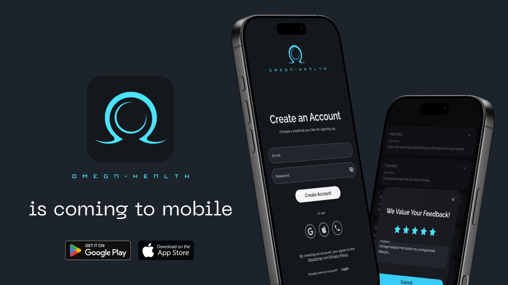

The OmegaX Platform is a **cross-platform** application that lives on:

- **Mobile** (iOS & Android via Flutter)
- **Web** (any modern browser)
- **Desktop** (macOS, with plans to expand to Windows)

Its primary role? To serve as the **interaction hub** for your personal AI health agent—through voice calls, chats, real-time data feeds, and a clean UI that keeps all your health information at your fingertips.

## **Why a Cross-Platform App?**

We want users to **seamlessly** access their health companion no matter where they are—on the couch with a laptop, on the subway with a phone, or at a work desk with a Mac. Thanks to **Flutter**, we can maintain a consistent look and feel across all platforms without sacrificing performance or user experience.

## **Core Features**

### **1. Voice & Chat Interaction**

- **Human-Like Calls**: Instead of just receiving a push notification, users can get a real **phone call** from their AI assistant. Feeling stressed? The agent might call to offer breathing exercises or schedule a last-minute telehealth check-in.
- **Fast, Contextual Chat**: For quieter settings or quick checks, users can chat with the agent in real time. Ask about symptoms, request a new workout plan, or just get a daily motivational nudge.

### **2. Rich Data Feeds**

- **Apple HealthKit & Google Fit**: Automatically import daily steps, heart rate, sleep patterns, and other wearable metrics. The AI can then use this data to tailor advice or trigger timely reminders (e.g., go for a quick walk if you’ve been inactive for too long).
- **Additional Device Integrations**: Blood pressure monitors, glucometers, and mental health trackers can all pipe data into the OmegaX Platform, creating one unified health profile.
- **User-Generated Inputs**: Through the app, you can log meals (including photos), symptoms, mental health journals, or any relevant medical documents (PDFs, scans, etc.).

### **3. Central Health Repository**

Think of OmegaX as your **digital health vault**. Instead of scattering your records across multiple apps and folders, you have one place to store everything:

- **Document Management**: Upload and securely store lab reports, prescriptions, or EHR exports.
- **Symptom Journals & Mental Health Logs**: Keep a day-to-day record of how you feel physically and emotionally—key data that helps the AI tailor its support.
- **Food & Lifestyle Tracking**: Snap a pic of your meal to get instant feedback, or log your mood after a workout to see patterns over time.

### **4. Location & Activity Insights**

If granted permission, OmegaX can access your location data—either from the phone or a connected wearable—to:

- **Offer Context-Aware Reminders**: Heading into a high-pollution area? The agent may suggest wearing a mask if you have asthma. Heading to the gym? It might automatically switch your schedule to “workout mode.”
- **Plan Modifications**: If you’re traveling or change time zones, the AI can adjust your sleep or medication schedule accordingly.

### **5. AI Logic on the Server Side**

While the app itself is robust, the **real magic** happens in the cloud. All advanced intelligence—LLM-based reasoning, data crunching, and personalized plan creation—lives on **our secure servers**. This means:

- **Real-Time Updates**: As soon as new data enters your profile, the AI can interpret and respond—no need to wait for app updates.
- **Continuous Learning**: The server is where usage patterns and anonymized data are aggregated, helping us refine the system without overloading your device.

## **Navigating the App: The Three Main Tabs**

We’ve organized the core user experience around **three** primary tabs to keep things intuitive and focused:

### **1. Home**

- **Daily Plans & Advice**: See your personalized schedule of workouts, medication reminders, mental health prompts, or any other tasks the AI suggests.
- **Quick Voice/Chat Access**: Initiate or receive real-time interactions with the AI. If you have a question about your blood pressure numbers or want to update your stress journal, it’s just a tap away.
- **Live Updates**: The plan adapts daily—or even hourly—based on your data. If your wearable notices a spike in resting heart rate, the AI might shift your workout intensity or suggest extra rest.

### **2. Data Feed**

- **Historical Timeline**: Scroll through a chronological log of all your health interactions—food photos, conversation transcripts, symptom journals, wearable metrics, and more.
- **Filters & Search**: Quickly narrow down the feed to see, for example, only your lab results from the past three months or conversations related to a specific symptom.
- **Analysis Snapshots**: The AI may insert quick summaries or trend alerts here, highlighting important changes over time (e.g., consistent improvement in blood pressure over several weeks).

### **3. Health Profile**

- **Snapshot of Your Health**: A visually rich overview showing your current status, conditions being monitored, and progress on any active goals (weight loss, improved cardio fitness, etc.).
- **Basic Demographics**: Easily update your weight, height, gender, or any other relevant data that helps the AI fine-tune its recommendations.
- **Condition & Goal Management**: Tag any major medical issues or personal objectives (e.g., training for a marathon), so the AI can incorporate them into its daily planning.

## **Why It Matters**

- **Proactive Healthcare**: Instead of waiting for your annual checkup, the OmegaX Platform keeps tabs on you *every day*.
- **Unified Data**: No more jumping between different apps. Everything flows into one system that can actually make sense of it all.
- **Human-Like Interaction**: Voice calling and real-time chat make the AI feel less like a robot and more like a constant companion who’s genuinely invested in your well-being.

We believe this **user-centric design**—supported by cutting-edge AI in the backend—is what will finally close the gap between *caring about your health* and *doing something about it, right now*.